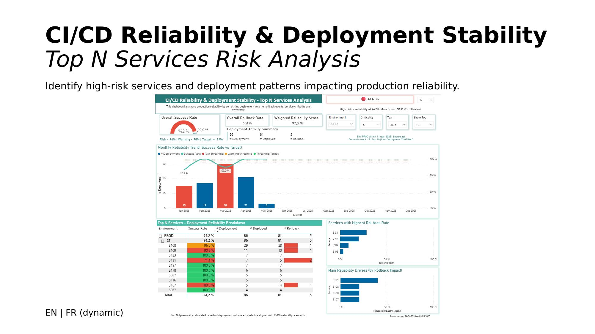
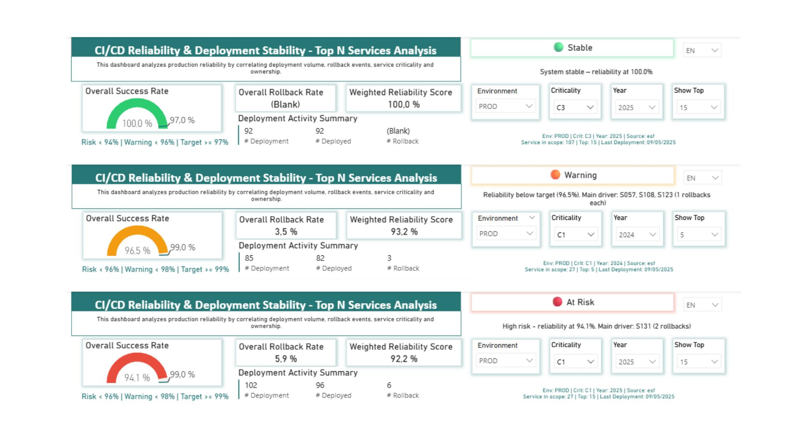
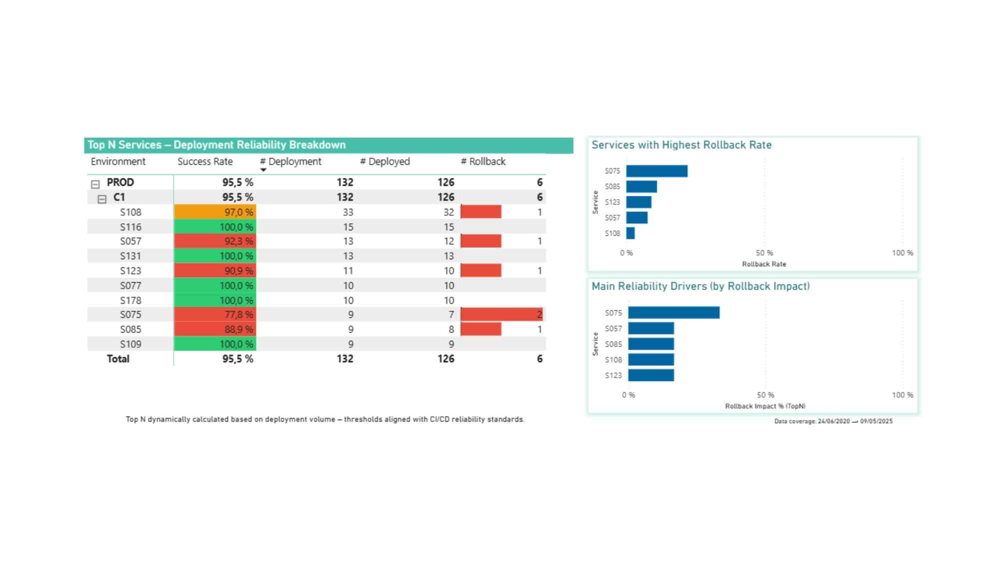
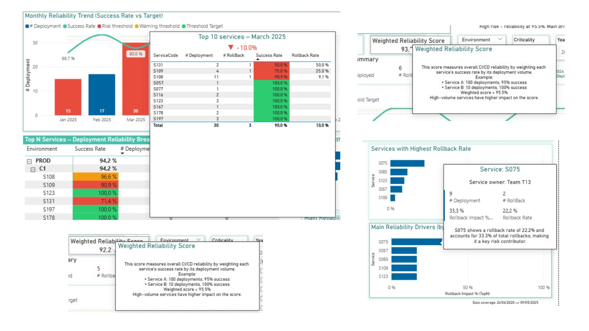

# CI/CD Reliability & Deployment Stability Dashboard

> A Power BI dashboard built during my Release Manager role at Worldline, tracking deployment health across 300+ services in a large-scale payment platform.

---

## Overview

As Release Manager at Worldline, I needed visibility into deployment patterns and failure risks across a complex microservices landscape. This dashboard was built to move from reactive incident response to proactive risk identification — spotting high-risk services before they impact production.

Data is sourced from a SharePoint-connected database query covering all deployment events and a service criticality registry, refreshed on a regular cadence.

---

## What this project demonstrates

| Area | Detail |
|---|---|
| **Real operational data** | 1,500+ deployment records across production and non-production environments |
| **Risk segmentation** | Services ranked by rollback rate, lead time variance, and deployment frequency |
| **Release Manager perspective** | Metrics chosen for operational decision-making, not vanity reporting |
| **Multi-source data model** | Deployment events joined to service registry (layer, value chain, criticality) |
| **Power Query / ETL** | SharePoint Excel exports ingested, cleaned, and shaped for analysis |

---

## Data sources

| Source | Description |
|---|---|
| **Deployment log** | DB query exported via SharePoint — all deployment events with status, version, environment, lead time |
| **Service registry** | 301 services mapped to layers, value chains, and product areas |

---

## Key metrics

| Metric | Value (Jan–May 2025) |
|---|---|
| Total deployments | 1,532 |
| Successful deployments | 1,489 (97.2%) |
| Rollbacks | 43 (2.8%) |
| Average lead time | ~60 days |
| Services tracked | 301 |
| Environments | GI DEV / GI INT / GI PROD |

---

## Service landscape

**Layers tracked:** PaymentEngine, Direct, Acquiring Hub, Legacy, MerchantPortal, Fraud, Tokenization, Collect, and more.

**Value chains covered:**

| Value Chain | Service count |
|---|---|
| Payment Methods | 102 |
| Integration | 40 |
| Acquiring | 43 |
| Others / Testing | 51 |
| Core | 19 |
| Collect | 10 |

---

## Dashboard pages

| Page | Purpose |
|---|---|
| **Overview** | Global deployment volume, success/rollback split, trend by month |
| **Top N Risk Analysis** | Services ranked by failure rate — filterable by layer and value chain |
| **Lead Time Trends** | Average lead time per period — identifies process bottlenecks |
| **Service Drill-Down** | Per-service deployment history, version tracking, environment promotion path |

---

## Screenshots

---

## Stack

- **Power BI Desktop** — report and data model
- **Power Query (M)** — SharePoint ingestion, data cleaning, join logic
- **DAX** — rollback rate, lead time averages, Top N ranking, period-over-period trends
- **SharePoint** — data source (Excel exports from internal DB queries)

---

## Context

This project was built internally at Worldline as a Release Manager tool. Data has been sanitized for publication — service names and internal identifiers are visible but no customer or transaction data is included.

The dashboard directly supported deployment planning decisions: which services to prioritize for stabilization, where lead times were trending upward, and which value chains carried the most deployment risk.

---

## About

Built as part of a 15+ year IT career spanning development and release management, now transitioning toward Data / BI Analysis roles.

**Related:** [PIID — Portfolio Investment Intelligence Dashboard](https://github.com/h4zer007/piid-portfolio) — a personal finance analytics project demonstrating DAX, star schema, and Monte Carlo simulation.
